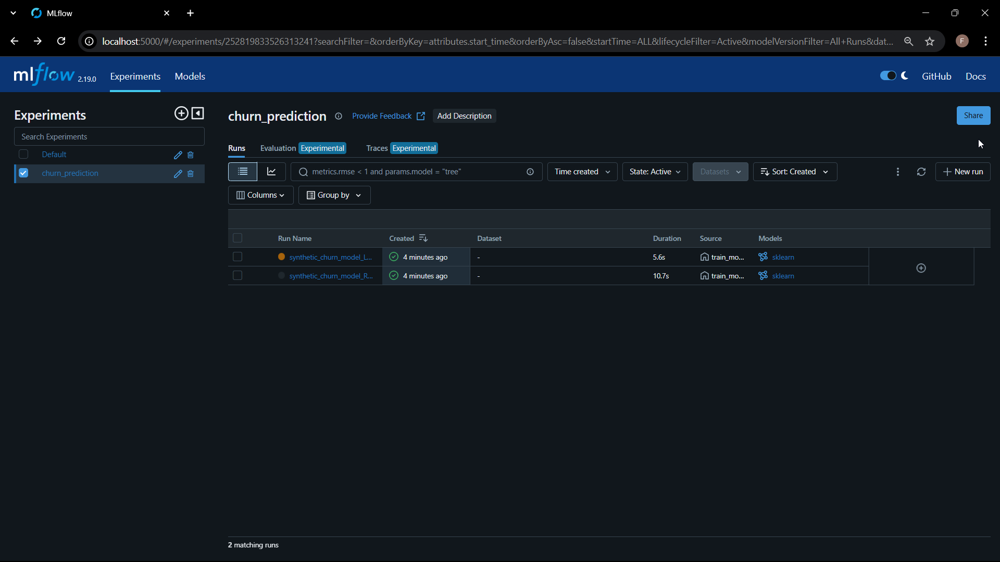
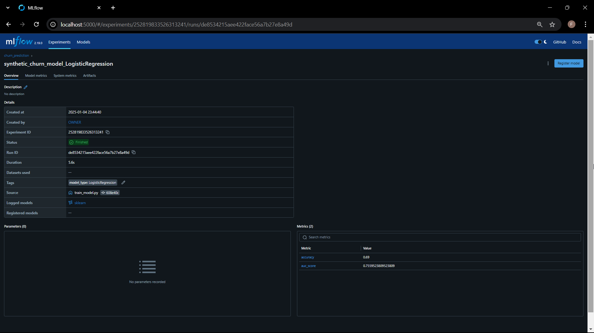
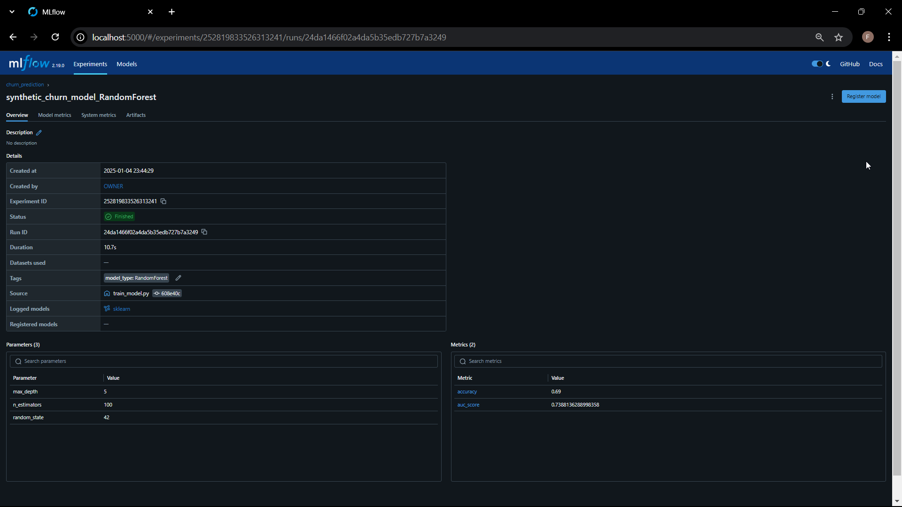
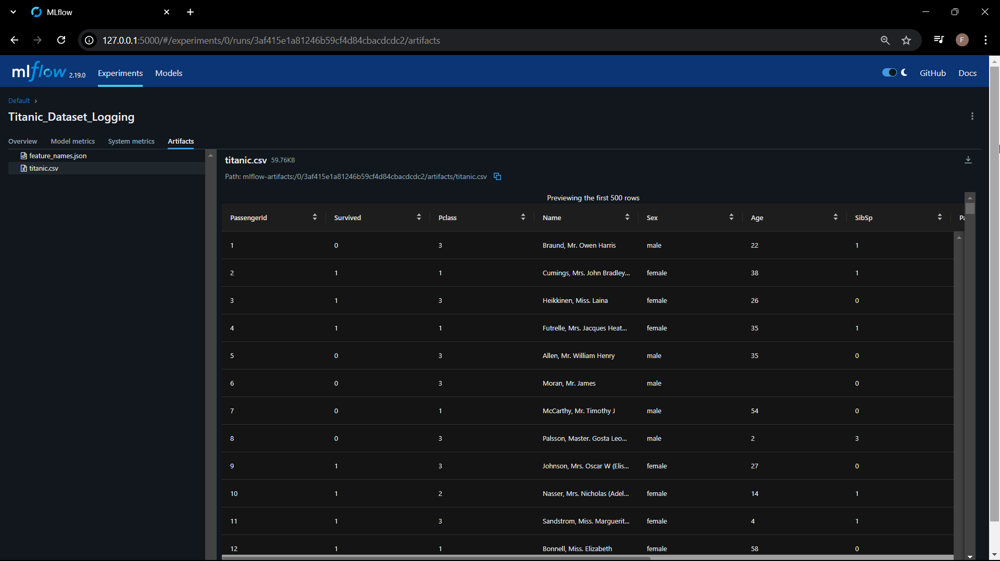
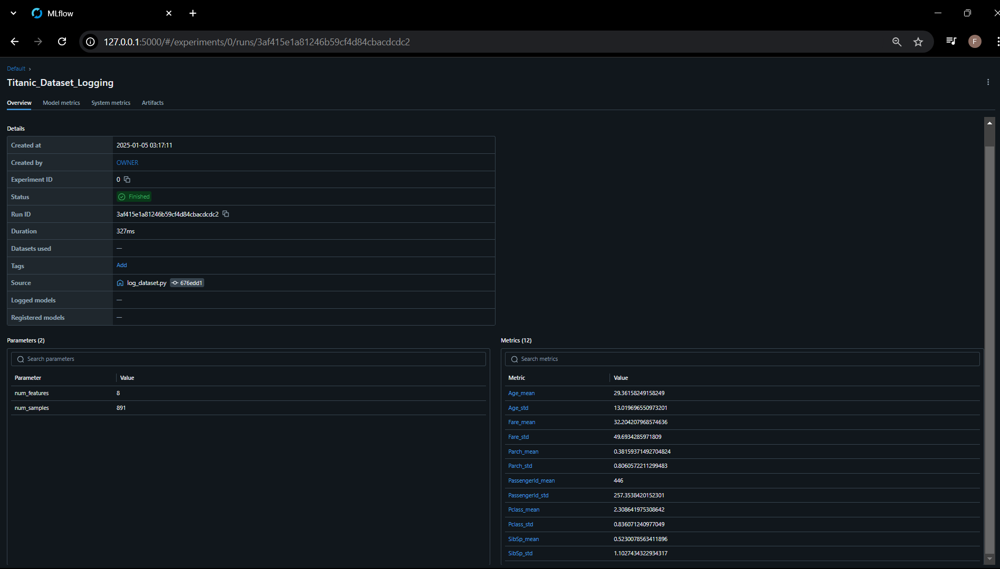
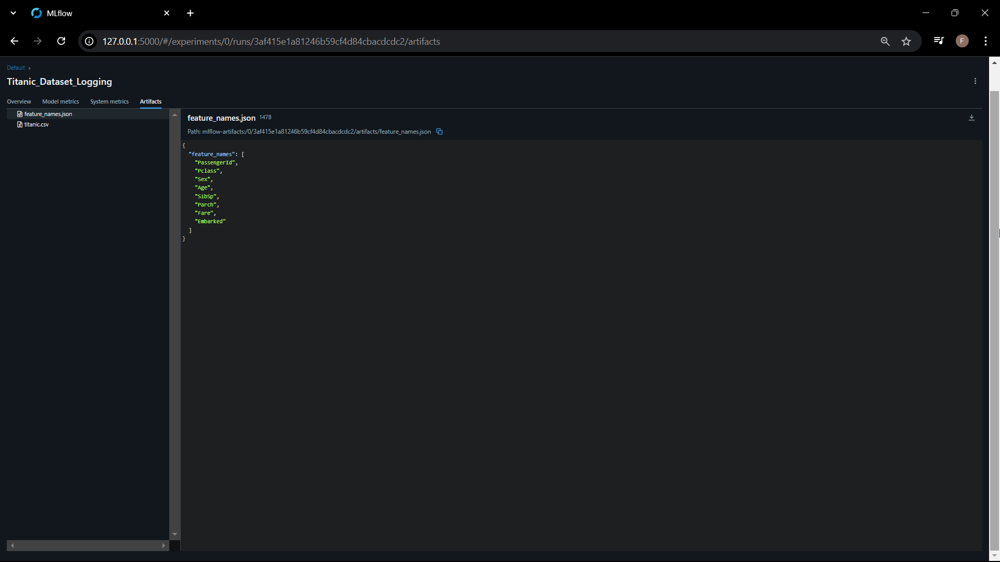

# MLFlow Task Report

## Task 1

Proyek ini melibatkan pelatihan dan logging dua model machine learning, yaitu **Random Forest** dan **Logistic Regression**, menggunakan dataset churn. Kita akan menganalisis performa kedua model berdasarkan tiga aspek utama: evaluasi akurasi dan AUC score, parameter model, dan metadata run.

### a. Logistic Regression

### b. Random Forest

### 1. **Evaluasi Accuracy dan AUC Score**

- **Accuracy**:
  - **Random Forest**: 0.69
  - **Logistic Regression**: 0.69
  - **Interpretasi**: Kedua model memiliki akurasi yang sama sebesar 69%. Ini menunjukkan bahwa dari seluruh prediksi yang dibuat oleh model, 69% di antaranya adalah benar. Namun, akurasi ini tidak selalu menjadi metrik terbaik untuk mengevaluasi performa model, terutama dalam dataset yang mungkin tidak seimbang.

- **AUC (Area Under the Curve)**:
  - **Random Forest**: 0.7388
  - **Logistic Regression**: 0.7559
  - **Interpretasi**: Nilai AUC Logistic Regression lebih tinggi dibandingkan Random Forest. AUC mengukur kemampuan model untuk membedakan antara kelas positif dan negatif. Dengan AUC yang lebih tinggi, Logistic Regression lebih baik dalam mengidentifikasi kelas churn yang benar dibandingkan Random Forest, meskipun selisihnya tidak terlalu besar.

### 2. **Melihat Parameter Model**

- **Random Forest**:
  - Parameter yang digunakan adalah:
    - `n_estimators`: 100 (jumlah pohon dalam hutan)
    - `max_depth`: 5 (kedalaman maksimum setiap pohon)
    - `random_state`: 42 (untuk memastikan hasil yang dapat direproduksi)
  - **Interpretasi**: Parameter `max_depth` yang dibatasi hingga 5 bertujuan untuk mencegah overfitting dengan mengurangi kompleksitas pohon. `n_estimators` yang sebesar 100 menunjukkan bahwa model ini menggunakan cukup banyak pohon untuk memberikan prediksi yang stabil.

- **Logistic Regression**:
  - Tidak ada parameter yang dilog di MLflow. Model ini menggunakan pengaturan default:
    - Regulasi `L2` untuk mencegah overfitting.
    - Solver `lbfgs` yang cocok untuk dataset dengan jumlah fitur yang relatif kecil hingga sedang.
  - **Interpretasi**: Logistic Regression adalah model linier sederhana yang biasanya tidak memerlukan banyak tuning parameter. Ini membuatnya lebih mudah untuk diimplementasikan dan diinterpretasikan.

### 3. **Memeriksa Metadata Run**

- **Durasi Pelatihan**:
  - **Random Forest**: 10.7 detik
  - **Logistic Regression**: 5.6 detik
  - **Interpretasi**: Logistic Regression memerlukan waktu pelatihan yang lebih singkat dibandingkan Random Forest. Hal ini disebabkan oleh sifat modelnya yang lebih sederhana dan kurang kompleks dibandingkan dengan Random Forest yang melibatkan banyak pohon keputusan.

Metadata lain yang dicatat selama pelatihan mencakup informasi tentang durasi pelatihan, jumlah pohon yang digunakan dalam Random Forest, kedalaman maksimum pohon, serta fitur-fitur yang dilibatkan dalam pelatihan. Data ini penting untuk analisis lanjutan, seperti evaluasi performa model di masa mendatang, tuning parameter, dan pemantauan drift data. Logistic Regression, meskipun tidak mencatat parameter eksplisit di MLflow, tetap menyediakan metrik performa yang relevan dan file JSON berisi nama fitur, yang berguna untuk mendeteksi perubahan pada data input di masa depan.

### Kesimpulan

Logistic Regression menunjukkan keunggulan dalam kecepatan pelatihan dan AUC yang lebih tinggi, membuatnya lebih efisien dan cukup efektif untuk dataset churn ini. Sementara Random Forest memerlukan lebih banyak waktu pelatihan karena kompleksitasnya, model ini menawarkan fleksibilitas yang lebih tinggi dalam mengatur parameter untuk mengatasi data yang lebih kompleks.

**Analisis Singkat Model Terbaik**: Logistic Regression memiliki performa yang sedikit lebih baik dalam hal AUC, dengan skor 0.7559 dibandingkan dengan 0.7388 dari Random Forest. Ini menunjukkan bahwa Logistic Regression lebih andal dalam membedakan antara pelanggan yang akan churn dan yang tidak. Meskipun kedua model memiliki akurasi yang sama sebesar 69%, perbedaan AUC ini menunjukkan bahwa Logistic Regression lebih efektif dalam situasi di mana probabilitas hasil lebih penting daripada sekadar prediksi klasifikasi yang tepat. Selain itu, Logistic Regression juga memerlukan waktu pelatihan yang jauh lebih singkat (5.6 detik dibandingkan 10.7 detik untuk Random Forest), membuatnya lebih praktis untuk digunakan dalam aplikasi dunia nyata yang memerlukan pembaruan model secara berkala atau saat data baru tersedia dengan cepat.

**Polanya yang Menarik**: Salah satu pola menarik yang muncul dari analisis ini adalah bahwa meskipun kedua model memiliki akurasi yang sama, Logistic Regression memiliki AUC yang lebih tinggi. Ini menunjukkan bahwa Logistic Regression lebih baik dalam memberikan probabilitas yang lebih akurat untuk setiap prediksi, yang sangat berguna dalam pengambilan keputusan berbasis risiko, seperti menentukan pelanggan mana yang perlu ditindaklanjuti untuk mengurangi churn. Sebaliknya, Random Forest, dengan akurasi yang sama namun AUC lebih rendah, mungkin menghasilkan prediksi probabilitas yang kurang akurat, meskipun masih cukup baik untuk beberapa kasus penggunaan. Pola ini menggarisbawahi pentingnya tidak hanya melihat akurasi, tetapi juga mempertimbangkan metrik lainnya seperti AUC untuk memahami performa model secara lebih menyeluruh.

---

## Task 2: Dataset Logging with Your Own Data

### Titanic Dataset Logging with MLflow

#### Deskripsi Dataset

Dataset yang digunakan dalam proyek ini adalah dataset Titanic yang digunakan untuk memprediksi apakah seorang penumpang selamat atau tidak dalam peristiwa tenggelamnya kapal Titanic. Dataset ini sering digunakan dalam tugas pembelajaran mesin untuk klasifikasi biner.

Dataset ini berisi informasi tentang penumpang Titanic, yang terdiri dari beberapa fitur yang dapat mempengaruhi kemungkinan selamatnya penumpang. Fitur-fitur yang tersedia antara lain:

- **Pclass**: Kelas penumpang (1, 2, atau 3).
- **Sex**: Jenis kelamin penumpang (laki-laki atau perempuan).
- **Age**: Usia penumpang (dalam tahun).
- **SibSp**: Jumlah saudara kandung atau pasangan yang ikut.
- **Parch**: Jumlah orang tua atau anak yang ikut.
- **Fare**: Tarif yang dibayar penumpang.
- **Embarked**: Pelabuhan keberangkatan penumpang (C = Cherbourg, Q = Queenstown, S = Southampton).
  
Dataset ini memiliki total 891 baris data dan 12 kolom, yang berisi informasi tentang penumpang dan apakah mereka selamat atau tidak. Beberapa kolom seperti `Age` dan `Cabin` memiliki nilai yang hilang, sehingga penanganan data yang hilang diperlukan dalam analisis lebih lanjut.

#### Screenshot 
1.

2.

3.

